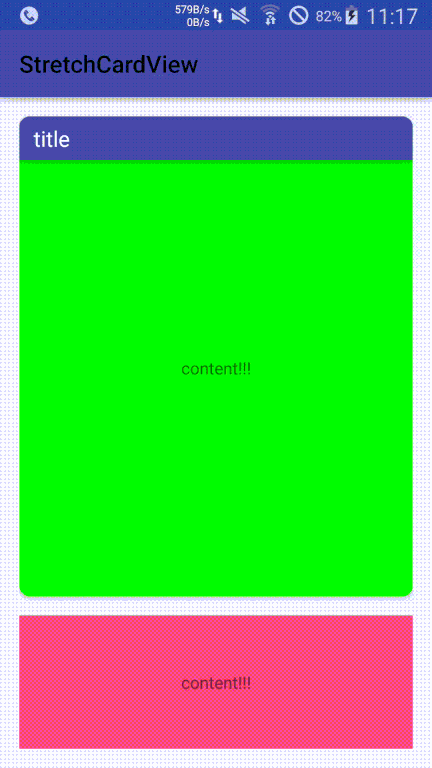

# StretchCardView

 Demo
----



Download
----

Gradle:
```
dependencies {
		compile 'com.github.5k5k:stretch-cardview:0.2.3'
}
```
Usage
----

``` 
    <com.pannny.view.StretchCardView
        android:id="@+id/scv"
        android:layout_width="match_parent"
        android:layout_height="400dp"
        app:cardCornerRadius="20dp"
        app:stretchCardTitleBackgroundColor="@color/colorPrimary"
        app:stretchCardTitleText="title name"
        app:stretchCardTitleTextColor="#fff"
        app:stretchCardTitleTextSize="8sp"
        >
		... other view
    </com.pannny.view.StretchCardView>
```